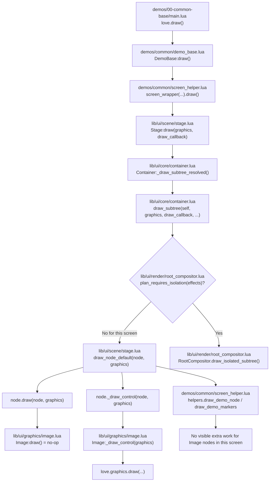
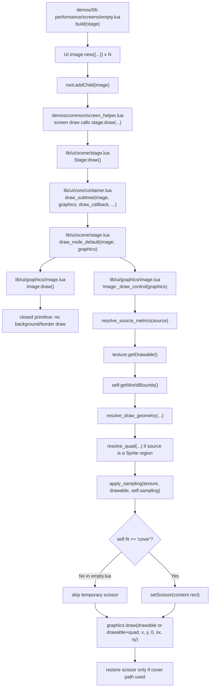

# `demos/06-performance/screens/empty.lua` Graphics Pipeline

This diagram is intentionally narrow. It traces the concrete draw path used by
[`demos/06-performance/screens/empty.lua`](/Users/vanrez/Documents/game-dev/lua-ui-library/demos/06-performance/screens/empty.lua:1),
not the full UI library.

## Frame Draw Flow

## Per-Image Hot Path

## What Is Specific To `empty.lua`

- All spawned nodes are `Image` primitives backed by one shared `Texture`.
- `fit = "contain"` and `sampling = "linear"` for every spawned image.
- The screen mutates only `x` and `y` during update; draw stays on the same image path each frame.
- No per-image root `opacity`, `blendMode`, `shader`, `mask`, or `clipChildren` is set in this screen, so the normal expectation is the non-isolated root-compositing path.
- The actual pixel submission happens in [`lib/ui/graphics/image.lua`](/Users/vanrez/Documents/game-dev/lua-ui-library/lib/ui/graphics/image.lua:284), not in `Image:draw()`.
